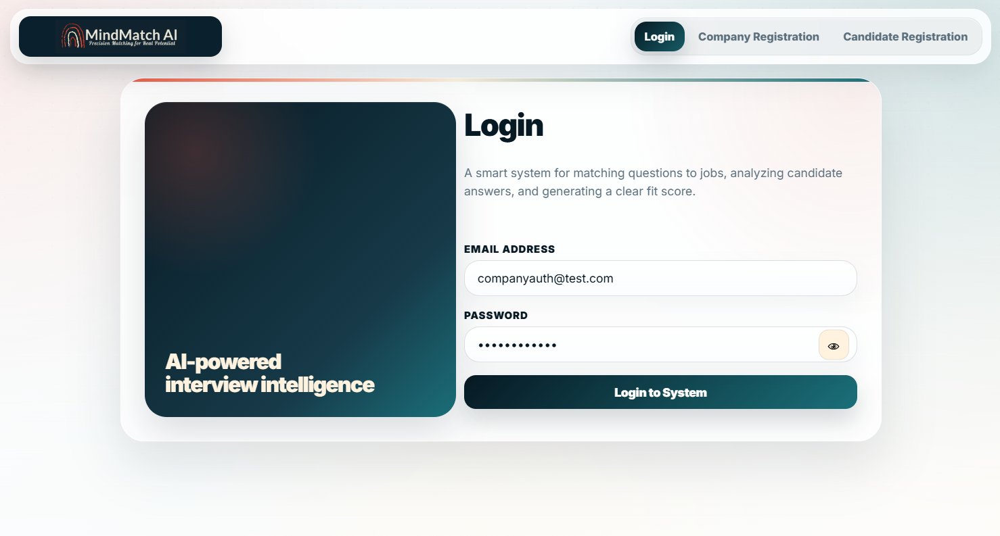
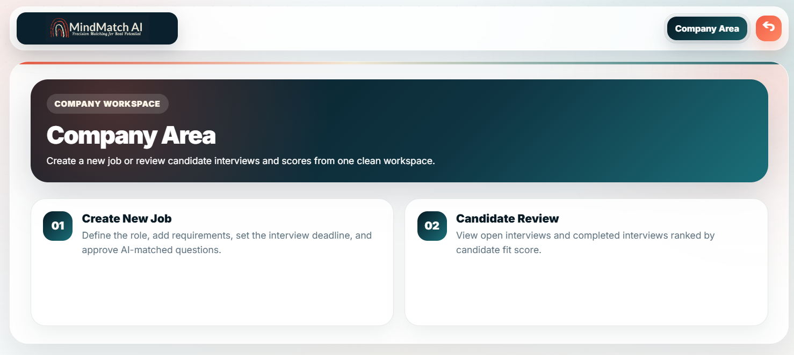
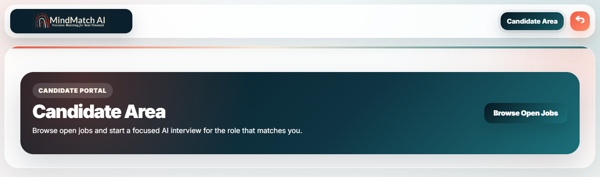
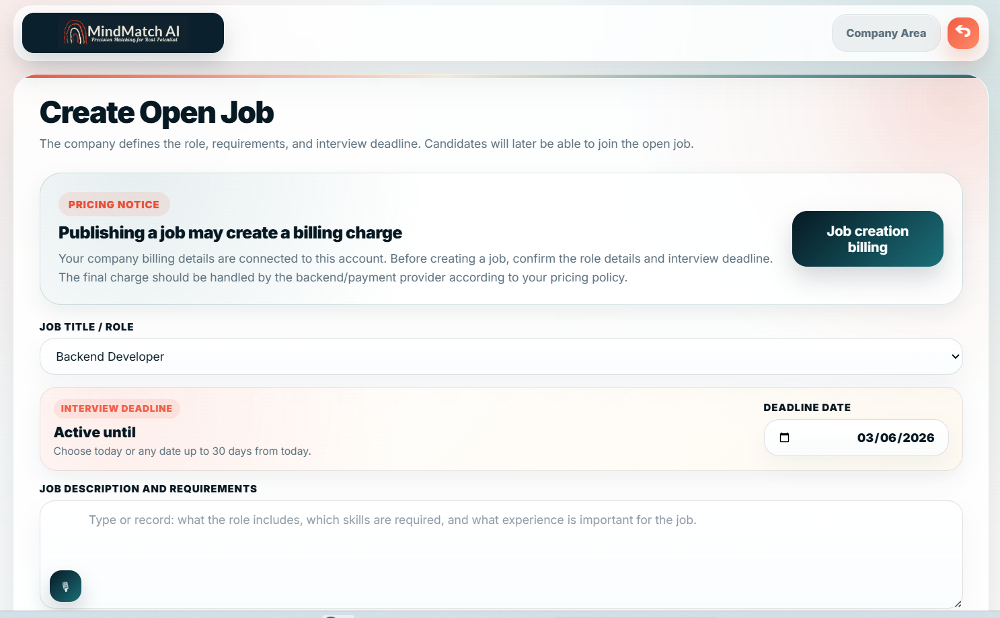
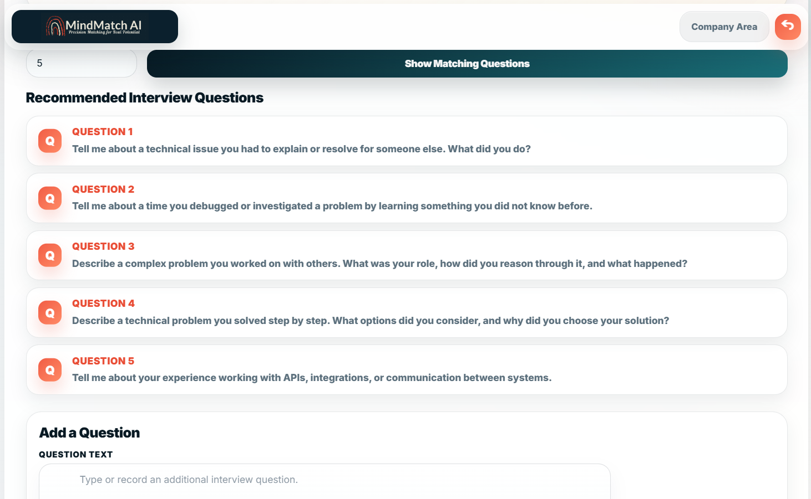
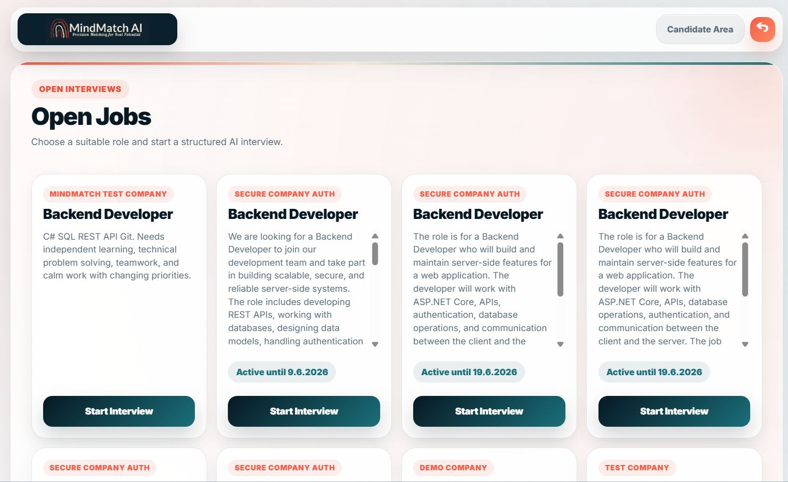
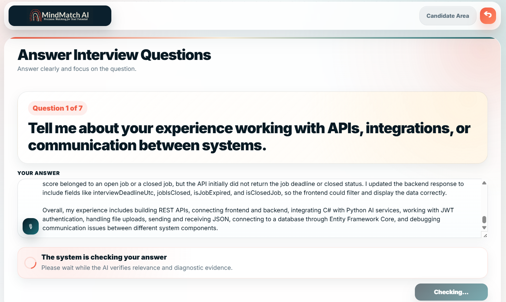
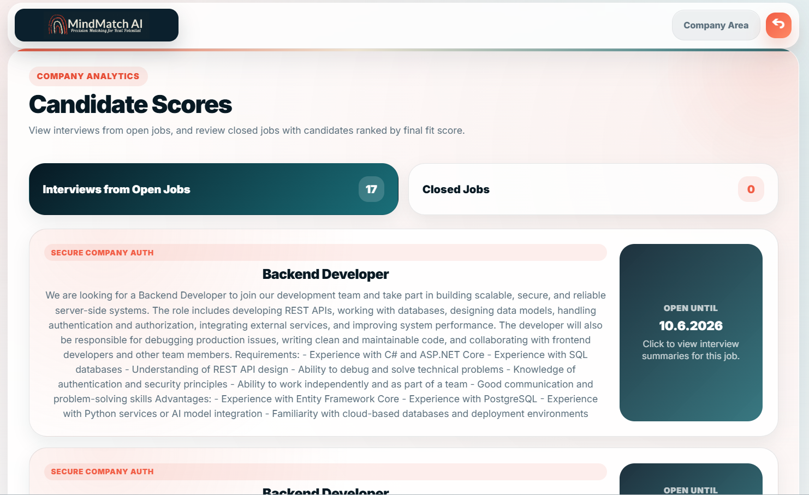
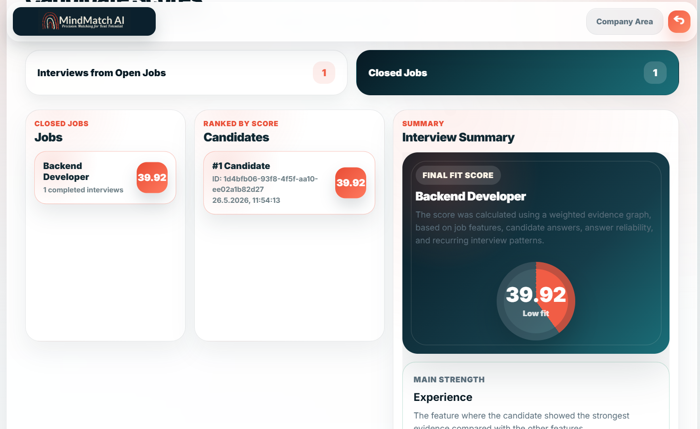

# MindMatchAI

MindMatchAI is an AI-based interview platform that helps companies evaluate candidates for open positions.
The system generates job-specific interview questions, allows candidates to answer using text or audio, analyzes the answers using AI/NLP models, and calculates an explainable final job-fit score.

## Overview

MindMatchAI is a full-stack application that combines a React frontend, an ASP.NET Core backend, a PostgreSQL database, and a Python/FastAPI AI model service.

The platform allows a company to create an open job position, generate customized interview questions based on the job description, collect candidate answers, analyze the quality and relevance of the answers, and return a final explained matching score for the role.

## Main Users

The system is designed for two main types of users:

* **Company / HR Manager**
  Creates job positions, manages interviews, views candidate results, and receives an explained matching score.

* **Candidate**
  Selects an open position and answers interview questions using text or audio.

## Features

* Company and candidate flows
* User registration and login
* Job position creation
* AI-based interview question generation
* Candidate interview flow
* Text-based answers
* Audio-based answers
* Speech-to-text processing
* Relevance analysis between questions and answers
* Automatic feedback for irrelevant answers
* AI/NLP-based answer analysis
* Routing answers to relevant diagnostic models
* Trait analysis
* Experience analysis
* Thinking quality analysis
* Practical ability analysis
* Motivation and culture-fit scoring
* Evidence graph generation
* Repeated pattern detection across answers
* Final explainable job-fit score
* PostgreSQL database persistence
* JWT-based authentication
* Personal data protection using hashing and encryption

## Project Structure

```text
MindMatchAI/
├── backend/        # ASP.NET Core Web API
├── frontend/       # React client application
├── ml-service/     # Python/FastAPI AI model service
├── docs/           # Documentation and screenshots
│   └── screenshots/
├── .gitignore
└── README.md
```

## Technologies Used

### Frontend

* React
* JavaScript
* CSS
* REST API integration

### Backend

* ASP.NET Core
* C#
* Entity Framework Core
* JWT Authentication
* Data Protection
* REST API

### Database

* PostgreSQL
* Neon Cloud Database
* Entity Framework Core Migrations

### AI / Machine Learning Service

* Python
* FastAPI
* AI / NLP models
* Speech-to-text
* Warm model server architecture

## Backend Responsibilities

The backend manages the core interview flow and business logic.

It is responsible for:

* Managing users and permissions
* Managing companies, candidates, jobs, questions, and interviews
* Receiving candidate answers in text or audio
* Sending audio for transcription
* Checking relevance between a question and an answer
* Providing feedback when an answer does not address the question
* Deciding which diagnostic models should be activated
* Sending requests to the Python model server
* Saving diagnostic results in the database
* Calculating derived categories such as Motivation and Culture Fit
* Building an evidence graph for each candidate
* Detecting repeated patterns across answers
* Calculating the final matching score
* Returning explained results to the company

## AI / NLP Service

The Python service is responsible for running the AI/NLP models used by the system.

The models support:

* Relevance checking between a question and an answer
* Failure reason detection when an answer does not match the question
* Routing answers to the appropriate diagnostic models
* Trait analysis
* Experience analysis
* Thinking quality analysis
* Practical ability analysis
* Job-specific question generation
* Speech-to-text transcription

In the final version, the models run through a warm Python model server.
This means the models are loaded into memory once and remain available for HTTP requests from the ASP.NET Core backend, instead of loading a new Python process for every request.

## Database

The system uses a PostgreSQL database hosted on Neon.

The database is accessed using Entity Framework Core and includes migrations and models for managing the application data.

The database stores data such as:

* Users
* Companies
* Candidates
* Job positions
* Interview questions
* Interviews
* Candidate answers
* Relevance checks
* Diagnostic results
* Routing decisions
* Final scores

## Main Screens

The frontend includes the following main screens:

* Registration and login page
* Home / dashboard page
* Job creation page
* Job-specific questions page
* Open jobs page for candidates
* Candidate answer page for text or audio responses
* Results / matching score page

## How to Run the Project

The project includes three main parts:

1. Python AI model server
2. ASP.NET Core backend API
3. React frontend client

### 1. Run the Python Model Server

```bash
cd ml-service
python -m uvicorn model_server:app --host 127.0.0.1 --port 8001
```

### 2. Run the Backend API

```bash
cd backend
dotnet restore
dotnet run
```

### 3. Run the Frontend

```bash
cd frontend
npm install
npm run dev
```

## Screenshots

### Login


### Company Dashboard


### Candidate Dashboard


### Create Open Job


### AI Question Suggestions


### Open Jobs


### Candidate Answer Check


### Candidate Scores


### Closed Job Ranking


## What I Learned

During the development of this project, I practiced and improved skills in:

* Building a full-stack application
* Connecting a React frontend to an ASP.NET Core backend
* Designing a REST API
* Working with Entity Framework Core
* Managing a PostgreSQL database
* Integrating a backend system with a Python AI service
* Running AI/NLP models through a warm model server
* Handling text and audio candidate answers
* Designing an explainable scoring flow
* Structuring a full-stack application with separate frontend, backend,  and AI service layers

## Future Improvements

* Improve the user interface design
* Add advanced admin dashboards
* Add more detailed candidate analytics
* Improve deployment setup
* Add Docker support
* Add automated tests
* Add CI/CD pipeline
* Add production-ready documentation

## Resume Summary

Developed MindMatchAI, an AI-based interview platform that generates job-specific interview questions, collects candidate answers via text or audio, analyzes responses using NLP models, provides feedback on irrelevant answers, and calculates an explainable final job-fit score using React, ASP.NET Core, Entity Framework Core, PostgreSQL, Python, and FastAPI.

## Documentation

A detailed project book is available here:

[MindMatchAI Project Book](docs/MindMatchAI_Project_Book.pdf)


Model weights are not included in the repository because of file size.
The project includes the model server code and expected model paths.
Weights should be placed under ml-service/models/ before running the full AI pipeline.
Set WHISPER_MODEL_PATH to the local Whisper model directory.
Set FFMPEG_PATH if ffmpeg is not available globally.